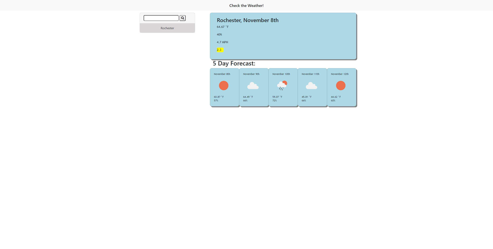

# weather-manager
https://jamesleitschuh02.github.io/weather-manager/

## About the Project
Weather-manager is a website that displays weather for a given city. User inputs a city, and the current weather is displayed for that city. There is also a five day weather that is displayed. Each search is displayed in history, where the user can click these searched city's to display them again.

## Built With
css
javascript
jquery
bootstrap